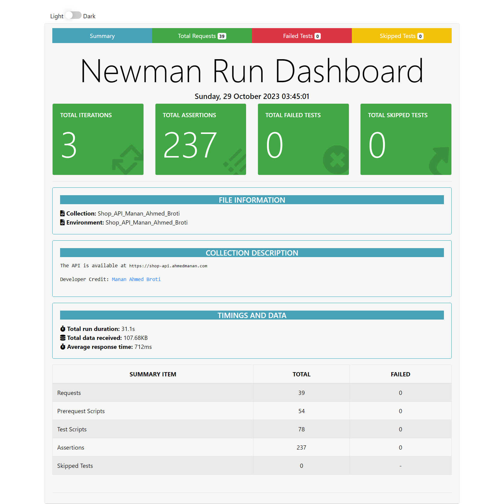

# Shop_API_Test_Report

## How to run this project
- Clone this project
- Open with Postman / Command Shell
- Run Command:  
```console 
newman run Shop_API_Manan_Ahmed_Broti.postman_collection.json -e Shop_API_Manan_Ahmed_Broti.postman_environment.json
```
- Run Command for Report: 
```console 
newman run Shop_API_Manan_Ahmed_Broti.postman_collection.json -e Shop_API_Manan_Ahmed_Broti.postman_environment.json -r cli,htmlextra
```
- Run Command for Report With Iteration: 
```console 
newman run Shop_API_Manan_Ahmed_Broti.postman_collection.json -e Shop_API_Manan_Ahmed_Broti.postman_environment.json -n "number of iteration" -r cli,htmlextra
```

## Technology used:
- Postman
- Newman

## Prerequisite:
- Jdk
- Node Js
- Newman
- Html Report Library

## Newman and Report Installation Process:
- Newman Install Command:
```console
npm install -g newman
```
- Newman Html Report Install Command:
```console
npm install -g newman-reporter-htmlextra
```
## Live API Test Report:
- https://ahmedmanan.com/api_report

## API Documentation:
- [https://documenter.getpostman.com/view/13082503/2s93Xwz4Az](https://documenter.getpostman.com/view/23708981/2s9YRGy9ao)

## Newman Report Summary:


Total Number of Test Scripts 78 and a Total of 237 Assertions were done. All of them passed with 0 skipped tests. The number of iterations is 3.

## Test case list & Test Features:
1. ### Registration
   - &check; Create data sets using the dynamic random variables.
   - &check; Generate authentication token
   - &check; Check status code
   - &check; Store the dataset in the environment

2. ### Login
	In the test I have validated the following field values & checked those features:
 	- &check; Email
 	- &check; Password
 	- &check; Generate token
 	- &check; Check status code

3. ### Create A Product
	In the test I have validated the following field values & checked those features:
 	- &check; Create data sets using dynamic random variables
	- &check; Check status code is 201 [created]
 	- &check; Product price validation
 	- &check; Product quantity validation
 	- &check; Product name validation
	- &check; Store dataset in the environment
 
 4. ### Get all products list
	In the test I have validated the following field values & checked those features:
 	- &check; Check status code 
 	- &check; Check the product ID found in the list
 	- &check; Check the product name found in the list
 	- &check; Check the product description found in the list
	- &check; Check the product category found in the list
   	- &check; Check the product quantity found in the list
    	<li>&check; Check the product price found in the list</li>
     	<li>&check; Check the product picture found in the list</li>
 
 5. ### Get a product details by ID
	In the test I have validated the following field values & checked those features:
 	- &check; Check status code 
 	- &check; Product ID validation
 	- &check; Product name validation
 	- &check; product description validation
	- &check; Product category validation
   	- &check; Product quantity validation
    	<li>&check; Product price validation </li>
     	<li>&check; Product picture validation </li>

 6. ### Get a product photo
	In the test I have validated the following field values & checked those features:
 	- &check; Check status code 
 	- &check; Check response contains a photo or not
 	- &check; Product photo validation

 7. ### Update product details
	In the test I have validated the following field values & checked those features:
 	- &check; Create data sets using dynamic random variables
  	- &check; Check status code 
 	- &check; Product ID validation
 	- &check; Product name validation
 	- &check; product description validation
	- &check; Product category validation
   	- &check; Product quantity validation
    	<li>&check; Product price validation </li>
     	<li>&check; Product picture validation </li>

 8. ### Create a new order
	In the test I have validated the following field values & checked those features:
 	- &check; Create data sets using dynamic random variables
  	- &check; Check status code is 201 [created]
 	- &check; Product ID validation
 	- &check; Product name validation
 	- &check; Order quantity validation
	- &check; Buyer ID validation
   	- &check; Buyer name validation

9. ### Get all orders list
    In the test I have validated the following field values & checked those features:
  	- &check; Check status code
	- &check; Check Order ID in the list
  	- &check; Check order price in the list
  	- &check; Check order status in the list
  	- &check; Check order notes in the list
  	- &check; Check buyer ID in the list
  	- &check; Check buyer name in the list
  	- &check; Check buyer mobile no in the list
  	- &check; Check buyer address in the list
  	- &check; Check order billing type in the list
  	- &check; Check order billing status in the list
  	- &check; Check order discount in the list
  	- &check; Check order quantity in the list
  	- &check; Check Product ID in the list
  	- &check; Check seller ID in the list
  	- &check; Check seller name in the list   

10. ### Get an order details by ID
    In the test I have validated the following field values & checked those features:
  	- &check; Check status code
	- &check; Check Order ID
  	- &check; Check order price
  	- &check; Check order status
  	- &check; Check order notes
  	- &check; Check buyer ID
  	- &check; Check buyer name
  	- &check; Check buyer mobile no
  	- &check; Check buyer address
  	- &check; Check order billing type
  	- &check; Check order billing status
  	- &check; Check order discount
  	- &check; Check order quantity
  	- &check; Check Product ID
  	- &check; Check seller ID
  	- &check; Check seller name    

11. ### Update order details by ID
    In the test I have validated the following field values & checked those features:
  	- &check; Check status code
	- &check; Check order status changed or not
	- &check; Check order quantity changed or not 

12. ### Delete a product
    In the test I have validated the following field values & checked those features:
  	- &check; Check status code

13. ### Logout
    In the test I have validated the following field values & checked those features:
  	- &check; Check status code is 204 [Not Found]

## Conclusion & More
In this API test project, I have tested all the API routes & performed effective tests. To learn more about APIs & HTTP requests you can read my blogs/posts:
- [Understanding API Concepts](https://ahmedmanan.com/blog/understanding-api-concepts/)
- [HTTP Fundamentals](https://ahmedmanan.com/blog/http-fundamentals/)
